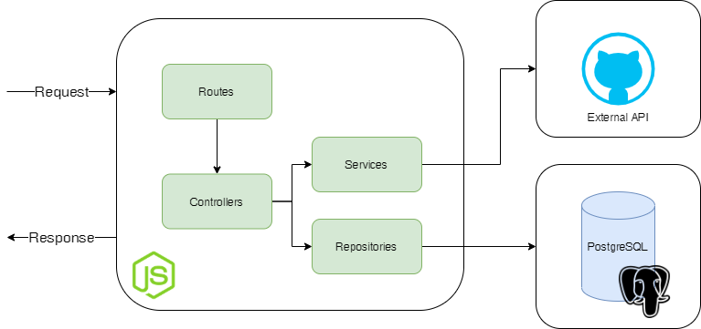

## Arquitetura



A arquitetura foi desenhada com os seguintes componentes:


**Aplicação Node.js (Express)**

- Routes: A aplicação roda em node.js, utilizando o framework express. Essa camada é responsável por orquestrar todas as chamadas do front-end, recebendo as requisições e direcionando para a rota solicitada. Aqui está o mapeamento das possíveis requisições e o direcionamento destas.

- Controllers: Em seguida, será chamada a execução da requisição no controlador. É nessa etapa que são chamadas as funções de calculos necessários para obter o resultado esperado, para armazenamento das informações, além da definição do que será retornado na resposta.

- Services: Chamado pelo controller, no serviço é onde de fato são chamadas as apis necessárias para obtenção dos dados, bem como os devidos cálculos.

- Repositories: Os repositórios são as entidades do banco de dados. Aqui é utilizado o knex para gerenciamento da conexão e realização das consultas.

**Banco de Dados (PostgreSQL)**

Para armazenar as informações da aplicação o banco de dados utilizado é o PostgreSQL, um gerenciados de banco de dados relacional de código aberto dos mais avançados, conhecidos e utilizados atualmente. O mesmo foi utilizado pela facilidade de configuração e utilização, tanto para desenvolvimento como produção.

**APIs Externas**

- GitHub API: Para obtenção dos dados retornadas pela aplicação, foi utilizada a API do GitHub (https://developer.github.com/v3/)


## Configurações iniciais

Crie o arquivo ```.env``` com as configurações de ambiente, de acordo com o arquivo ```.env.sample```

Instale as dependencias necessárias

    npm install


## Como iniciar a aplicação em desenvolvimento

Inicie o banco de dados, caso não tenha realizado anteriormente

    docker-compose up -d

Realizar a migracão para o database criado

    npx knex --env development migrate:latest

Caso queira dados iniciais para histórico de issues

    npx knex --env development seed:run

Execute o seguinte comando para iniciar

    npm run start:dev

Para obter as informações das issues do repositório desejado, a aplicação espera receber a requisição

    Método: GET
    URL: http://localhost:3000/repo/<owner>/<repo>?user=<user>

O seed contém dados para os seguintes parâmetros

    owner: 'facebook', repo: 'react', user: 'test_username'
    owner: 'angular', repo: 'angular', user: 'test_username'


## Como executar os testes

Inicie o banco de dados, caso não tenha realizado anteriormente

    docker-compose up -d

Criar o database de teste

    docker-compose exec postgres_db psql -U github_api -c 'create database github_api_test;'

Realizar a migracão para o database criado

    npx knex --env test migrate:latest

Executar os scripts de teste

    npm test


## Como realizar o deploy

Realize o build da imagem do docker

    docker build . -t <nome_da_imagem>

Faça o deploy utilizando a imagem onde desejar
